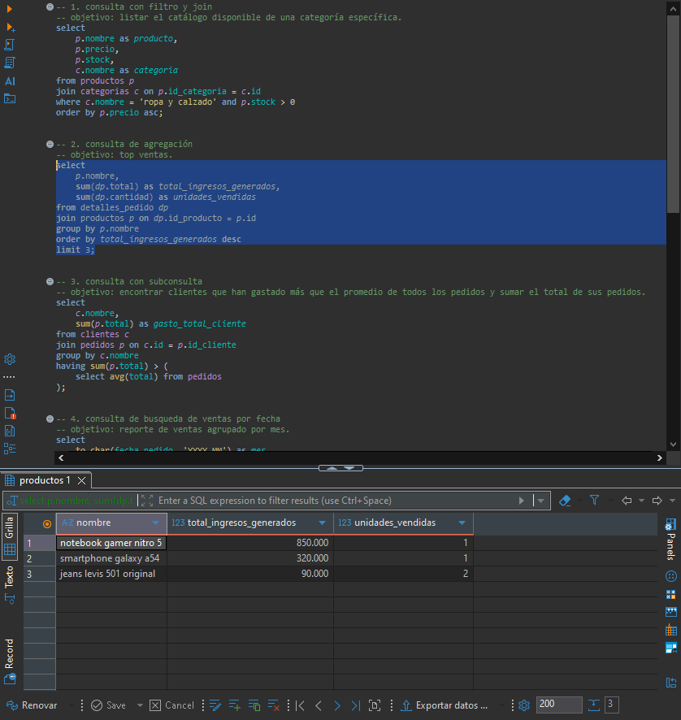
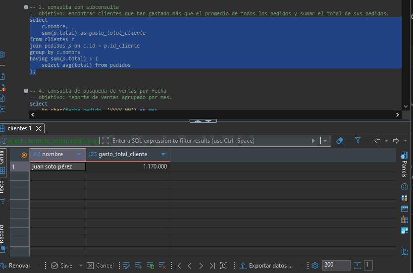
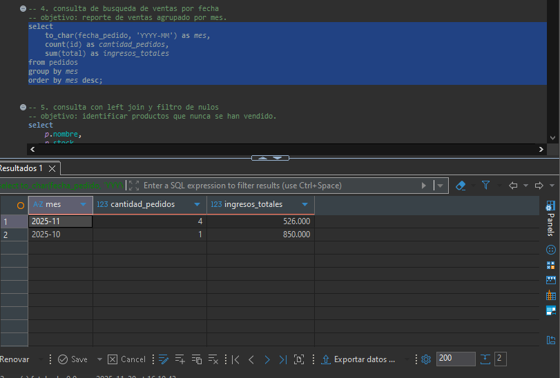
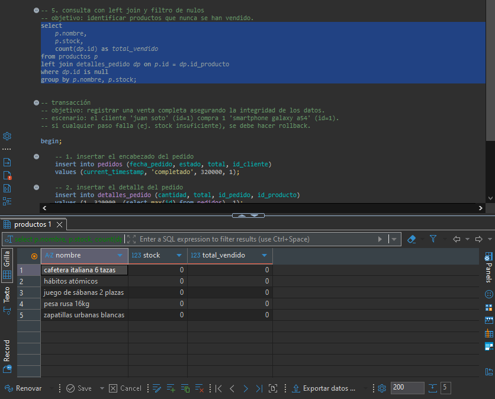

# Proyecto E-commerce - Módulo 3

Este repositorio contiene el modelo de base de datos relacional para una plataforma de E-commerce. El proyecto abarca desde el diseño del diagrama entidad-relación hasta la implementación en SQL, incluyendo la creación de tablas, inserción de datos de prueba, consultas analíticas de negocio y transacciones complejas.

## Descripción del Proyecto

El objetivo es administrar la información de una tienda en línea, gestionando:
* **Clientes:** Información personal y direcciones.
* **Productos y Categorías:** Inventario, precios y clasificación.
* **Pedidos y Detalles:** Registro de órdenes, cantidades y precios históricos.
* **Inventario:** Control de movimientos de stock (entradas y salidas).
* **Pagos:** Registro de transacciones financieras.

## Estructura del Repositorio

El proyecto está organizado en los siguientes archivos SQL:

1.  `schema.sql`: Contiene el DDL. Crea las tablas, define claves primarias/foráneas y establece restricciones de integridad (UNIQUE, NOT NULL, CHECK).
2.  `seed.sql`: Contiene el DML. Pobla la base de datos con categorías, productos, clientes y simula flujos de ventas históricos.
3.  `queries.sql`: Contiene consultas SQL avanzadas para reportes de negocio y una transacción de compra completa con control de integridad.

## Instrucciones de Instalación

Para desplegar este proyecto en tu entorno local, sigue estos pasos:

1.  **Crear la base de datos:**
    ecommerce_db_m3

2.  **Ejecutar los scripts en orden:**
    Es fundamental respetar el orden para evitar errores de dependencias.

    * **Paso 1:** Crear las tablas.
        schema.sql
    * **Paso 2:** Cargar datos de prueba.
        seed.sql
    * **Paso 3:** Ejecutar consultas y pruebas.
        queries.sql

## Diagrama Entidad-Relación (ER)

A continuación se presenta el modelo lógico de la base de datos:

## Evidencias de Consultas

A continuación se muestran capturas de pantalla de los resultados obtenidos al ejecutar `queries.sql` con los datos de prueba suministrados.

### 1. Búsqueda de productos por categoría

### 2. Top Ventas

### 3. Productos sin movimiento

### 4. Ventas mensuales

**Enlace Repositorio:** https://github.com/AndersAlejandro/ecommerce-db-m3
**Autor:** Anders Alejandro Mamani Choquehuanca
**Bootcamp:** Módulo 3